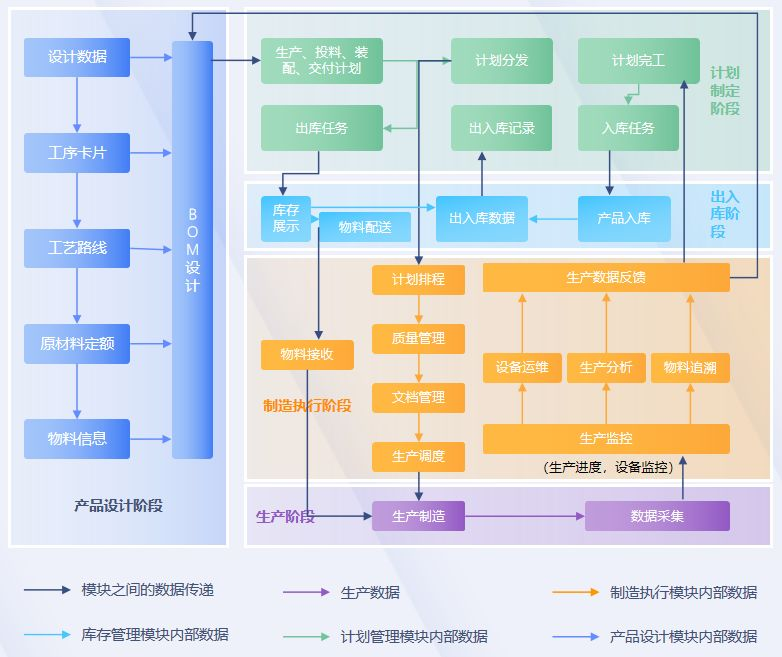

# 1. 什么是MES？

## 1.1. 定义

MES，Manufacturing Execution System，制造执行系统

## 1.2. 作用

对产品订单、质量、设备和资源等进行全面的动态管理。

位于管理系统（ERP）和现场控制系统（FCS）之间，起着承上启下的作用。

及时处理生产中的大量实时数据，对实时事件进行反应。

实现一体化产品质量跟踪，一体化计划与资源调度、一体化生产控制与管理。

## 1.3. 需求分析

实时数据库，完成海量数据的高效压缩和安全存储

实时数据管理系统：生产成本动态跟踪系统、生产实时调度系统、折本故障诊断、经济运行、产能优化、质量管理、生产过程可视化。

处理各种在线（产量、温度等）或离线（质量分析、实验数据等）的过程数据。

# 2. MES系统体系结构

## 2.1. 制造车间信息化架构

企业管理层

制造执行层

现场控制层

## 2.2. MES系统架构

### 2.2.1. 功能架构

### 2.2.2. 技术架构

### 2.2.3. 业务流程

## 2.3. 功能模块

### 2.3.1. 工艺管理

### 2.3.2. 工序管理

### 2.3.3. 物料清单

### 2.3.4. BOM管理

### 2.3.5. 计划管理

### 2.3.6. 库存管理

### 2.3.7. 工单管理

### 2.3.8. 设备管理

### 2.3.9. 生产管理

### 2.3.10. 质量管理

### 2.3.11. 文档管理

### 2.3.12. 数据统计

