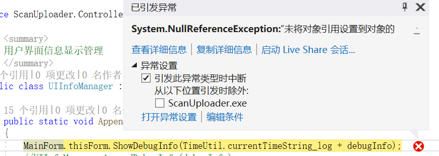
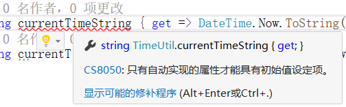
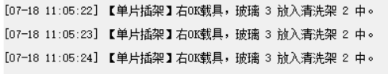
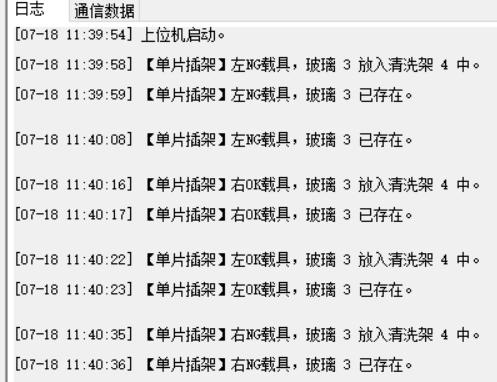
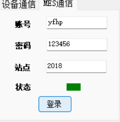
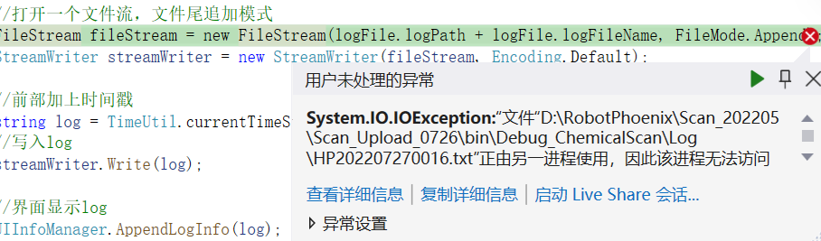
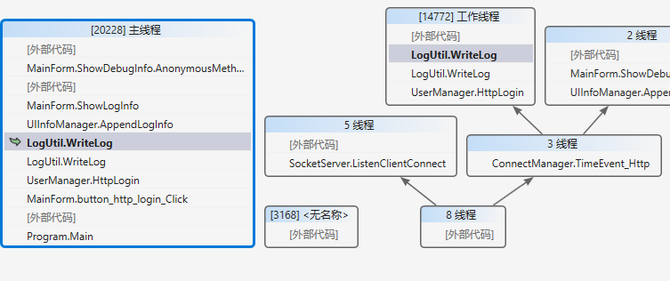
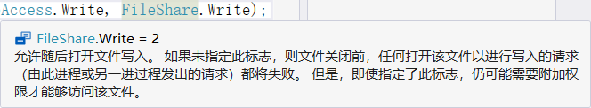
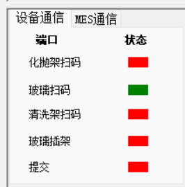

[TOC]

# 1. 需求

## 1.1. NG 信息统计

- 需求：
  - 对单片玻璃扫码NG原因进行分类
  - 输出NG原因汇总表单
    - 玻璃码 - NG原因

- NG原因：
  - 没扫到（NoRead）
  - MES反馈错误（500）

- 技术点：
  - csv文件输出

# 2. 问题与解决

## 2.1. 静态属性赋初值

### 2.1.1. 问题

定义了一个类，它是带有get{}的静态属性。

```CSharp
public class TimeUtil
{
    public static string currentTimeString { get => DateTime.Now.ToString("yyyy-MM-dd HH:mm:ss");}
    public static string currentTimeString_log { get => "[" + DateTime.Now.ToString("yyyy-MM-dd HH:mm:ss") + "] ";}
}
```

此时没有对静态属性初始化，C#编译器将其初始化默认为null，直接访问会有NullReferenceException异常。



此时不能直接对属性初始化，因为get{}函数体中有内容，属性不是自动实现的属性。


### 2.1.2. 解决

应该使用**静态构造函数**对静态属性进行初始化，添加set{}以使属性能过够赋值。

```CSharp
    public class TimeUtil
    {
        public static string currentTimeString { get => DateTime.Now.ToString("yyyy-MM-dd HH:mm:ss"); set { } }
        public static string currentTimeString_log { get => "[" + DateTime.Now.ToString("yyyy-MM-dd HH:mm:ss") + "] "; set { } }

        static TimeUtil()
        {
            currentTimeString = "";
            currentTimeString_log = "";
        }
    }
```

## 2.2. 集合类判重

### 2.2.1. 问题

`List`的`Cantain()`方法无法去重。

```C#
if (operationID == submit_OK_Left && !GlobalValue.GlassList_OK_Left.Contains(glass))
{
    GlobalValue.GlassList_OK_Left.Add(glass);
    LogUtil.WriteLog("【单片插架】左OK载具，玻璃 " + glass.snNumber + " 放入清洗架 " + glass.targetVehicle + " 中。");
}
```



### 2.2.2. 解决

自定义类的列表使用`Cantain()`函数时，需要判重操作的对象的类需要重写`Equal()`方法。

```CSharp
/// <summary>
/// 玻璃类
/// </summary>
public class Glass
{
    //重写Equals方法
    // override object.Equals
    public override bool Equals(object obj)
    {
        if (obj == null || GetType() != obj.GetType())
            return false;
        else
            return Equals(obj as Glass);
    }

    // override object.GetHashCode
    public override int GetHashCode()
    {
        return snNumber.GetHashCode();
    }

    public bool Equals(Glass anotherGlass)
    {
        if (anotherGlass == null)
            return false;

        return snNumber.Equals(anotherGlass.snNumber);
    }
}
```




## 2.3. Time 循环调用

在连接MES时，有一个登录操作，用来获取Http Post请求时的`Authorization`。

在启动上位机时，会自动登录MES，与此同时，会启动一个Timer来对连接时间进行记录，超时则重新登录。（如此操作是因为客户规定每12小时会更换一次Token，所以不到12小时就要重新登录一下。）

```CSharp
private void MainForm_Load(object sender, EventArgs e)
{
    ...

    //http用户登录以更新Token
    UserManager.HttpLogin(httpUser);
    //启动连接计时器，每11小时重新登录一次
    ConnectManager.Instance.StartTimer_Http();

    ...

}
```

有时由于网络问题等原因，没有登录成功，需要操作员手动点击登录，于是添加了如下控件：



## 2.4. 日志写入冲突

### 2.4.1. 问题

接上一个问题，添加登录MES的控件后，如果在几乎超时登录的同时，点击登录按钮，则会出现一个IO异常：



### 分析

不同进程不能同时对同一个文件进行写入操作，写入日志的逻辑应由同一线程完成。

查看并行堆栈窗口，发现主线程和1472工作线程都执行了`LogUtil.WriteLog`，因而产生了冲突。



主线程的`LogUtil.WriteLog`是由`MainForm`发起的，即点击登录按钮时执行的，而1472工作线程的`LogUtil.WriteLog`是由Timer的回调函数`ConnectManager.TimeEvent_Http`分支出来的。

### 解决

#### 方法1. 指定进程共享文件方式

`FileShare.Write` 




```CSharp
FileStream fileStream = new FileStream(logFile.logPath + logFile.logFileName, FileMode.Append, FileAccess.Write, FileShare.Write);
```

#### 方法2. 只用一个线程写入日志

将日志写入操作用一个线程完成。

- 创建一个日志管理类，实现单例模式，
- 定义日志管理类日志写入函数，并且应该是同步的，
- 使用单例调用其日志写入函数。

## Socket服务器端判断客户端的连接与断开

### 问题

需要实现Socket连接开断的判断逻辑，以在界面中显示上位机与设备的连接状态。



```CSharp
//检查socket连接状态
if (clientSocket.Poll(1000, SelectMode.SelectRead))
{
    //已挂起、关闭、重置或终止
    CloseSocket(clientSocket);
    break;
}
```
如上使用`Socket.Poll()`方法并不能满足需求，因为`Poll(1000, SelectMode.SelectRead)`返回值为`true`的情况比较多，不仅包括连接断开的情况：

`
public bool Poll (int microSeconds, System.Net.Sockets.SelectMode mode);
`
基于 mode 参数中传递的轮询模式值的 Socket 的状态。
|Mode|Return|
|---|---|
|SelectRead|如果已调用 `Listen(Int32)` 并且有挂起的连接，则为 `true`。<br>或 - 如果有数据可供读取，则为 `true`。<br> 或 - 如果连接已关闭、重置或终止，则返回 `true`；否则，返回 `false`。|
|SelectWrite|如果正在处理 Connect(EndPoint) 并且连接已成功，则为 true；<br> 或 - 如果可以发送数据，则返回 true；否则，返回 false。|

采用这种方法判断Socket断开并不理想，因为当有数据可读时，`Poll()`返回也为`true`，因此如果客户端两次发送时间间隔很短时，就会因为有数据可读而判断为 `true`，出现 Socket 连接断开的情况。

# 3. 通用型软件开发

## 3.1. 框架


## 3.2. 技术

反射