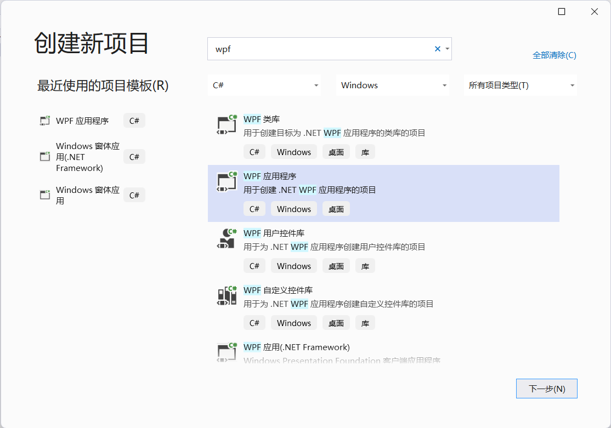
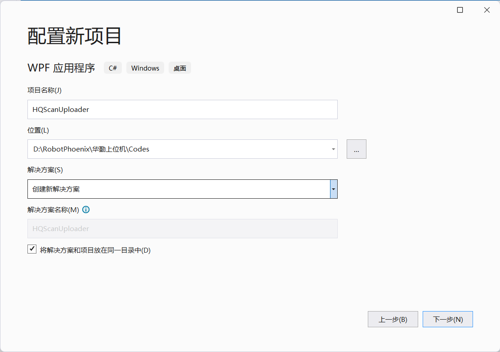
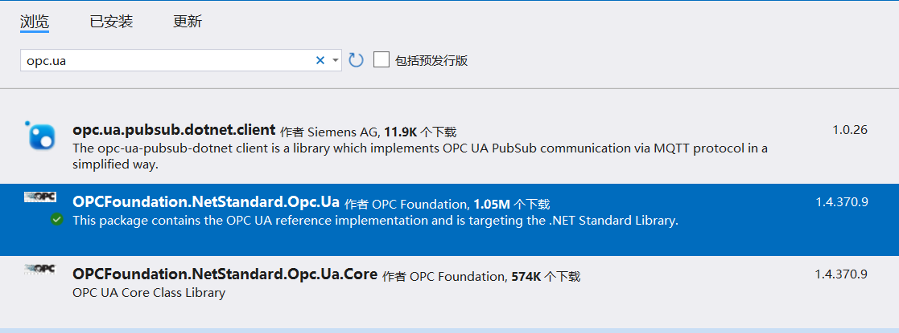

[TOC]

# 华勤上位机开发笔记

## 需求分析

|功能模块|说明|
|---|---|
|通信|使用 OPC UA 监测 PLC 变量值|
|扫码|两处扫码，数据线码和充电器码|
|定位|两个相机，抓手和目标位|

## 新建项目

### 开发环境

开发环境最终选择了 Visual Studio 2022 + WPF + .net 6.0 的方案。

使用Visual Studio 2022

选择 `.NET 6.0` 版本。

### OPC.UA

打开NuGet，安装OPC官方 OPC UA 库，版本选择目前最新的1.4.370.9。

